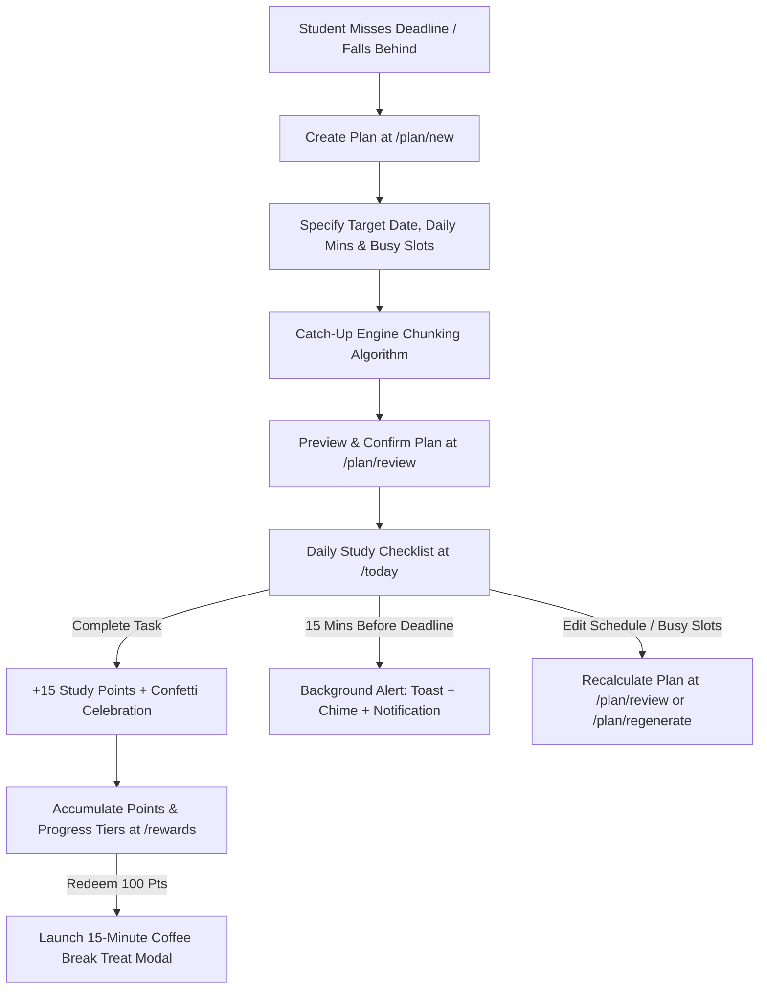

# ⚡ Study Streak Rescue

> **Gamified Academic Recovery & Dynamic Catch-Up Engine**  
> *Transform missed academic deadlines and study backlog into clear, balanced day-by-day recovery schedules with a Microsoft Rewards-inspired study incentives dashboard.*

---

## 📌 Executive Summary

**Study Streak Rescue** is a full-stack MERN application built to solve student burnout and deadline recovery. When students fall behind on coursework or miss target deadlines, traditional to-do lists cause overwhelm. Study Streak Rescue algorithmically breaks down study topics into manageable daily chunks, accounts for busy time slots, reserves rest days, and motivates continuous study through a gamified rewards economy.

---

## ✨ Key Features

### 🎯 1. Algorithmic Catch-Up Engine
- **Smart Workload Chunking**: Dynamically splits oversized study topics into balanced 30–60 minute daily action items.
- **Usable Days & Rest Preservation**: Calculates usable study days between today and your target deadline while preserving reserved rest days.
- **Busy Slots Protection**: Reserves recurring busy time blocks (e.g., classes, jobs, tutoring) and adjusts daily study capacity automatically.
- **Regenerate & Recalculate**: If you fall behind or edit busy slots, the engine recalculates remaining incomplete tasks without resetting completed history.

### 🏆 2. All-in-One Rewards Dashboard (`/rewards`)
- **Points Balance & Monthly Tiers**: Earn **Study Points** by completing daily tasks and unlock monthly scholar tiers (**Starter** ➔ **Focused** ➔ **Elite Tier**).
- **3 Parallel Streaks**: Tracks 3 independent streaks simultaneously:
  1. *Daily Task Streak* (Completing at least 1 task daily)
  2. *Full-Day Completion Streak* (Clearing all daily tasks)
  3. *App Review Check-In Streak* (Reviewing your schedule daily)
- **Inline Perks Shop**: Redeem points for self-set study treats:
  - ☕ **Coffee Break Treat** (100 Pts): Unlocks a 15-minute relaxation timer modal with soothing audio chime.
  - 👑 **Gold Scholar Badge** (150 Pts): Displays exclusive profile badge across the app.
  - 🌙 **Midnight Focus Theme** (200 Pts): Unlocks dark mode theme toggle.
  - 🛡️ **Extra Streak Shield** (250 Pts): Forgives 1 missed study day per month.
- **Points Transaction Ledger & Charts**: Includes a daily points bar chart (7-day / 30-day filter) and itemized ledger tracking point earnings and perk redemptions.

### 📚 3. Multi-Subject Catch-Up Tracking
- Manage multiple active subject catch-up plans (e.g. *Computer Science*, *Calculus*, *Physics*) simultaneously.
- Switch between active subjects seamlessly on the **Plan Review** screen or view unified daily tasks on **Today's Checklist**.

### ⏰ 4. Real-Time 15-Minute Deadline Reminder Alerts
- **Background Monitor**: Continuously monitors pending tasks and target deadlines in the background across all pages.
- **Multi-Channel Alert**: When a task deadline is 15 minutes away, triggers:
  - 🟡 **Toast Notification Banner**
  - 🎵 **Web Audio Chime** (587Hz ➔ 880Hz dual-tone chime)
  - 📱 **Browser OS Desktop Notification**

### ☕ 5. Interactive 15-Minute Relaxation Coffee Break
- Includes a 15-minute relaxation countdown timer with Pause, Resume, Reset, and Web Audio finish chime to help students take guilt-free study breaks.

### 📅 6. Calendar Sync & Export Tools
- **iCalendar (.ics) Export**: Download `.ics` files to sync schedules with Apple Calendar, Microsoft Outlook, or local calendar apps.
- **Google Calendar Integration**: Deep-links daily study tasks directly into Google Calendar.
- **PDF & Markdown Export**: Export catch-up timelines as clean PDF documents (`window.print()`) or copy formatted Markdown.

### 🔔 7. Modern Toast Notification System
- Replaced standard browser `alert()` popups with animated top-right toast notifications for success, error, warning, and info messages.

---

## 🗺️ Information Architecture (IA)

```
[ Application Root ]
  ├── /auth (User Login & Registration with Rate Limiting)
  │
  ├── /today (Daily Rescue Hub)
  │     ├── Multi-Subject Task Checklist (+15 Pts per task)
  │     ├── 25-Min Pomodoro Focus Timer Modal
  │     └── Victory Fanfare & Confetti Celebration Modal
  │
  ├── /plan
  │     ├── /new (Catch-Up Plan Generator & Busy Slots Selector)
  │     ├── /review (Active Subject Timelines, Calendar Sync, Busy Slots Manager & PDF Export)
  │     └── /regenerate (Dynamic Plan Recalculation)
  │
  ├── /rewards (Unified All-in-One Rewards Hub)
  │     ├── Points Balance & Monthly Tier Progress
  │     ├── 3 Parallel Streaks & Study Punch Cards
  │     ├── Inline Perks Shop (Coffee Break, Gold Badge, Dark Theme, Shield)
  │     └── Daily Points Bar Chart & Transaction Ledger
  │
  ├── /progress (Velocity Donut Charts & Weekly Streak Performance)
  │
  └── /profile (User Profile, Level Badges & Account Settings)
```

---

## ⚙️ System Architecture & Technology Stack

### Frontend Architecture
- **Framework**: React 18 (Vite)
- **Styling**: Modern Vanilla CSS + Tailwind CSS (Clean, minimal palette `#F8FAFC`, `#0F172A`, `#2563EB`)
- **State & Context**: `AuthContext` (JWT authentication) + `ToastContext` (Global Toast Notifications)
- **Data Visualization**: Recharts (Donut & Bar Charts)
- **Icons**: Lucide React
- **Audio Engine**: Web Audio API (Synthesized chimes for timer finishes, victory fanfare, and deadline alerts)

### Backend Architecture
- **Runtime**: Node.js + Express
- **Database**: MongoDB (Mongoose) with automatic fallback to `mongodb-memory-server` if local MongoDB is offline
- **Authentication**: JWT (JSON Web Tokens) with `bcryptjs` password hashing
- **Security & Validation**: `express-rate-limit` (auth brute-force protection) + `express-validator` (input schema validation)
- **Date Calculation**: Day.js

---

## 🔄 Application Workflow



---

## 🚀 Getting Started & Local Setup

### Prerequisites
- Node.js (v18 or higher)
- npm (v9 or higher)
- MongoDB *(Optional: Server automatically falls back to MongoMemoryServer if local Mongo daemon is not running)*

### 1. Clone the Repository
```bash
git clone https://github.com/polaakshithareddy/Study_Streak_Rescue.git
cd Study_Streak_Rescue
```

### 2. Install Dependencies
```bash
# Install root, backend, and frontend dependencies
npm run install:all
```

### 3. Run Development Servers
```bash
# Start backend server (Port 5000)
cd server
npm run dev

# In a separate terminal, start frontend dev server (Port 3000)
cd client
npm run dev
```
Open **[http://localhost:3000](http://localhost:3000)** in your browser.

### 4. Run Automated Backend Tests
```bash
cd server
npm test
```

---

## 🌐 Production Deployment Guide

### Deploying to Render.com (Single Web Service)
1. Fork or push this repository to GitHub.
2. Create a new **Web Service** on [Render](https://render.com).
3. Set **Build Command**: `npm run install:all && npm run build`
4. Set **Start Command**: `npm start`
5. Add Environment Variables:
   - `NODE_ENV`: `production`
   - `JWT_SECRET`: `your_secure_jwt_secret_key`
6. Render will automatically build the React Vite bundle and serve it from Express!

---

## 📄 License
This project is licensed under the MIT License.
